# システム概要

## 利用サービス

- Google Sites
- はてなブログ
- Google Apps Script (GAS)

### Google Sites

固定ページの配信を担当する  
ホームページの入口と静的コンテンツや流動的コンテンツへの導線を提供する。  
一度掲載したらほとんど更新しないが内容を最新状態に保つ必要がある情報や見栄えを含めてドキュメントとして完成された情報を掲載する。

- LP
- 固定ページ
- 情報の寿命が長い
- 常に最新に更新する

さらに・・・  
サイトを2つ作成し、ひとつは一般公開、もうひとつはアクセス制限を設ける。  
ひとつのサイトで部分的に閲覧制限を設ける機能はないのでサイトを2つ使用する。

> 
> Google Sitesの使い方は本家のヘルプを参照してください。
> 
> - [Google サイトの使い方(Googleヘルプ)](https://support.google.com/sites/answer/6372878?hl=ja) ・・・使い方全般
> - [サイトを公開して共有する(Googleヘルプ)](https://support.google.com/sites/answer/6372880?hl=ja) ・・・公開範囲の設定
> 

### はてなブログ

動的で流れていく情報の配信を担当する  
情報の寿命が短く、一度掲載したらほとんど更新しない情報を掲載する。情報に変更があった場合には新しい情報を掲載することで情報を更新する。

- 流動的
- 情報の寿命が短い
- 更新するより別の情報を掲載することで最新情報を提供

> 
> はてなブログの使い方はこちらから。
> - [Hatena Blog](https://hatenablog.com/guide)
> 

### Google Apps Script

はてなブログから記事一覧を取得しGoogle Sitesに埋め込む機能を提供する。

このシステムのために作成したscriptの内容やホームページへの設定方法は以下を参照してください。

- [ソースコード](lib/)

> 
> Google Apps Script の使い方はこちらへ
> - [Google Apps Script](https://developers.google.com/apps-script/)
> 

## 概要図

