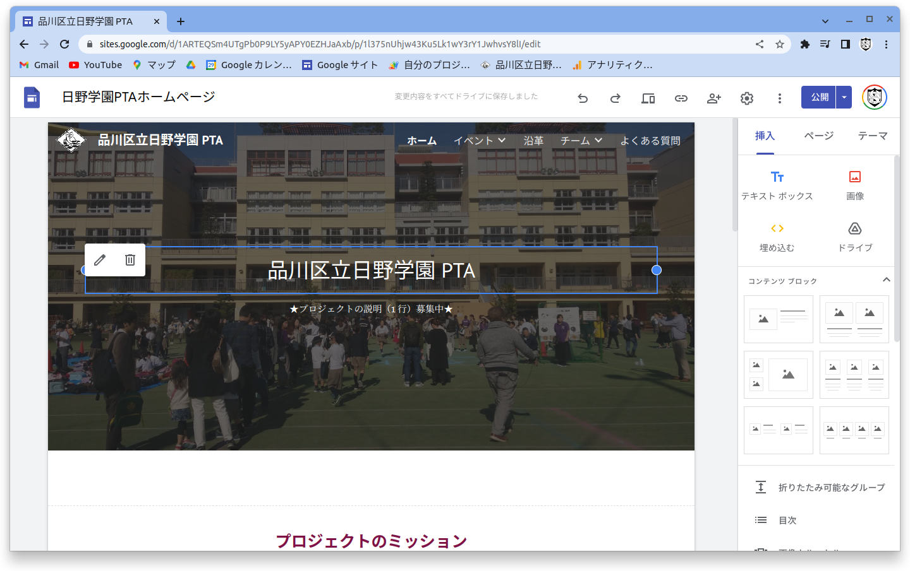

<!-- _paginate: false -->
<!-- _class: invert -->

# PTAホームページ説明

## 品川区立日野学園PTA

<div class="author">
2022年10月15日<br/>
日野学園PTA IT担当
</div>


---
## 本日の内容

- ホームページはどこ？
- 編集方法
- 投稿方法 (は？投稿ってなに？)
- うら側の話


---
## ホームページはどこ？

### :arrow_down: ここ！

https://sites.google.com/view/hinogakupta/


---


---
## 編集方法

1. 以下のサイトにアクセス
  https://sites.google.com/new

1. 以下のアカウントでログイン
  PTA 日野学園 (hinogakupta@gmail.com)

1. 最近使用したサイトから選択
  日野学園PTAホームページ

1. あとは"ほぼ"ワープロ:newspaper:と同じ。簡単:smile:


---



---

## 投稿方法 (は？投稿ってなに？)

- PTAの活動の状況などについて"簡潔に"お知らせ:loudspeaker:する行為
  - イベントの開催通知
  - ホームページの更新案内 など
- 以下のアドレスに:email:メール送信！
  xxxxxxxxxxxxx@blog.hatena.ne.jp (※)
  - メールを送るだけで掲載
  - HTMLメールも可 (盛れる！)
  - 記事のタイトルがトップページに掲載される
    - クリックしたら本文へ

※ 伏せ字にしました。[記事の投稿方法](https://sites.google.com/view/hinogakupta-members/ptaホームページ説明/記事の投稿方法)からご確認ください。(2022/10/16)

---


---

:bulb: くわしくはこちら

https://sites.google.com/view/hinogakupta-members/ptaホームページ説明/記事の投稿方法

- タイトルの指定方法
- カテゴリ
- ドラフト投稿
- 投稿の練習方法 など

---
## うら側の話

### :bulb: 実際はこうなってます。

- Google Sites (一般公開)
- Google Sites (アクセス制限あり)
- はてなブログ


---

### Google Sites (一般公開)

みなさんの入口。いままで説明していたPTAのホームページ。

### はてなブログ

投稿した記事が掲載される場所。
メール投稿は はてなブログ の機能を利用していました。

### Google Sites (アクセス制限あり)

閲覧者を制限できる場所。特定のグループに所属しているユーザのみ閲覧できるよう設定されています。(※次ページ参照)


---
### Google Sites (アクセス制限あり)
#### アクセス可能グループ

- R4日野学園PTA総務(hinogaku-soumu-r4@googlegroups.com)
- R4日野学園PTA安全部(hinogaku-anzen-r4@googlegroups.com)
- R4日野学園PTA学年部(hinogaku-gakunen-r4@googlegroups.com)
- R4日野学園PTA教養部(hinogaku-kyouyou-r4@googlegroups.com)
- R4日野学園PTA広報部(hinogaku-kouhou-r4@googlegroups.com)
  ※ 2022年10月16日時点


---
## もっと知りたい方は・・・

こちらに情報をまとめています。興味のある方はご覧ください。

- [PTAホームページ説明](https://sites.google.com/view/hinogakupta-members/ptaホームページ説明)
- [記事の投稿方法](https://sites.google.com/view/hinogakupta-members/ptaホームページ説明/記事の投稿方法)
- [固定ページの編集方法](https://sites.google.com/view/hinogakupta-members/ptaホームページ説明/固定ページの編集方法)
- [仕組み解説](https://sites.google.com/view/hinogakupta-members/ptaホームページ説明/仕組み解説)

```
https://sites.google.com/view/hinogakupta-members/ptaホームページ説明
https://sites.google.com/view/hinogakupta-members/ptaホームページ説明/記事の投稿方法
https://sites.google.com/view/hinogakupta-members/ptaホームページ説明/固定ページの編集方法
https://sites.google.com/view/hinogakupta-members/ptaホームページ説明/仕組み解説
```


---
## 相談窓口

slackにてご連絡ください。

#it担当 https://pta-feg1557.slack.com/archives/C038WGJ10LC

- ホームページに関する疑問・質問
- 部会単位のページの開設
- ハンズオン
  - 編集方法
  - 投稿方法


